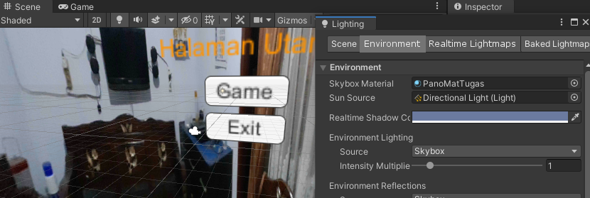
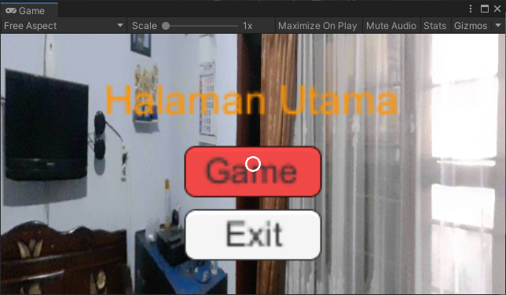
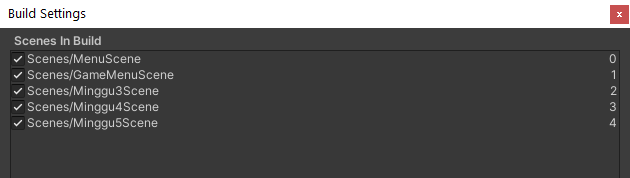
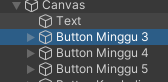
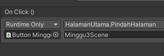
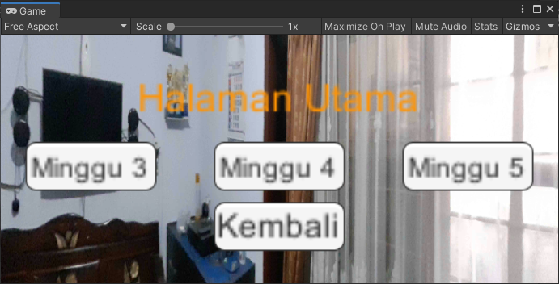
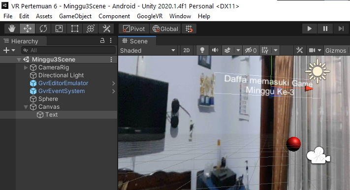
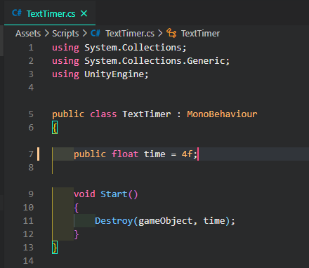
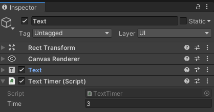
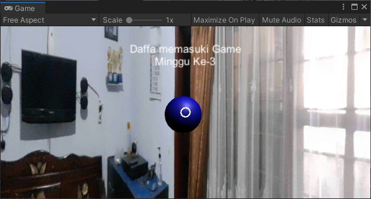

# Pemrograman Game Minggu Ke-6

Ekspor dan Impor semua asset dari Minggu ke-3 sampe ke-6 terlebih dahulu

## 1. Menambahkan Panorama pada halaman menu

Setelah mengimport assets dari pertemuan minggu ke-3, maka hanya perlu mengganti Skybox Material dengan material yang sudah dibuat

### Hasil

## 2. Menambahkan Scene untuk pemilihan game

1. Mempersiapkan Scene pada build settings

   

2. Membuat 3 button yang masing - masing akan mengarahkan ke Scene pertemuan sebelumnya

   

3. Menambahkan event onclick pada masing - masing button untuk berpindah scene

   

### Hasil

## 3. Menampilkan Teks pada saat berpindah Scene

1. Menambahkan game object text pada scene

   

2. Membuat Script untuk menghilangkan teks setelah beberapa waktu

   

3. Menambahkan komponen script ke objek teks

   

### Hasil

